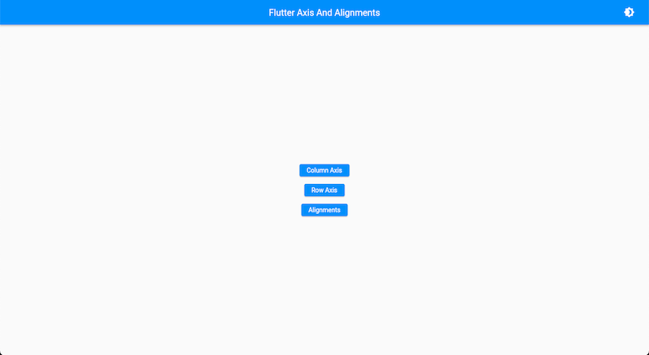
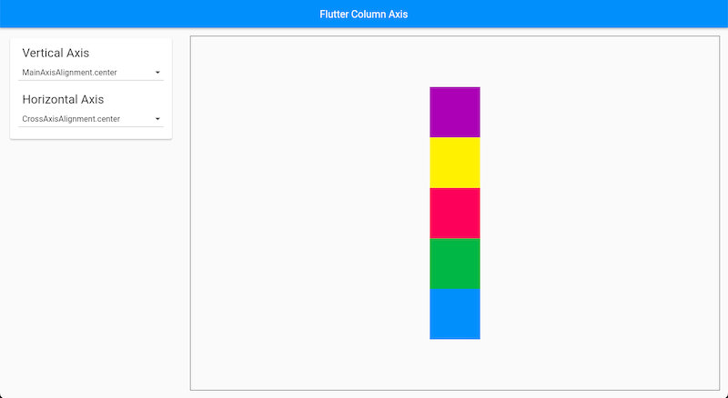
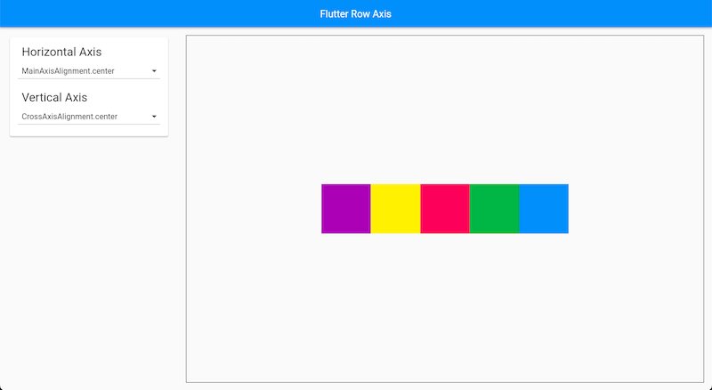
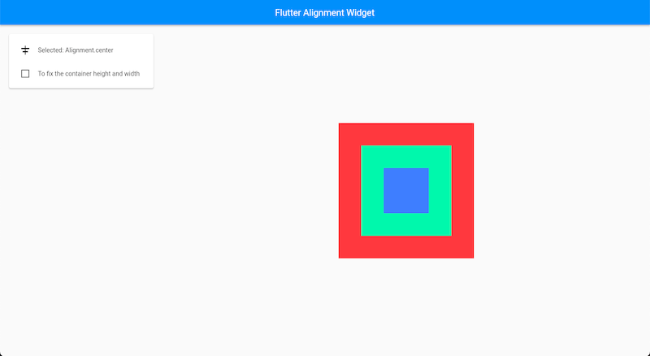

# Flutter Cross And Main Axis + Alignment

A flutter project to demonstrate how column and row cross and main axis works, how layout set based on the cross and main axis values also added animated alignment sample.

## Reference Screens

 
 

 
 

 
 

 
 

## Build & Release

- Add below line in the index.html

<pre>
&lt;base href=&quot;$FLUTTER_BASE_HREF&quot;&gt;
</pre>

- Execute this command 

<pre>
flutter build web --release --base-href /flutter_cross_and_main_axis/
</pre>

- Execute this command

<pre>
sudo sh release.sh
</pre>

- Push to GitHub and setup pages for main branch

### About me

I'm Kishan Donga and you can connect with me via the below links, I am a developer and I love to create innovations.

    
    
    
    

